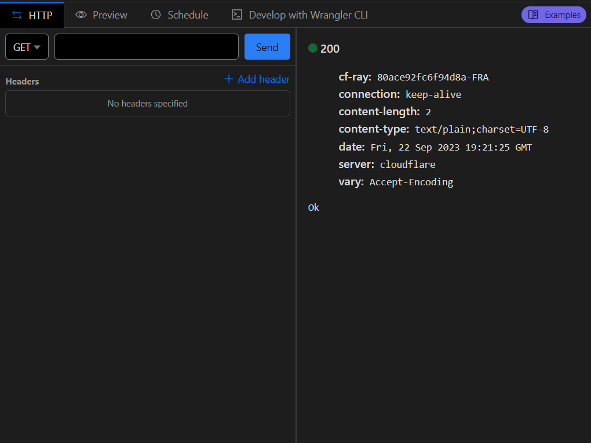

# v2-xBot

v2-xBot is multi panel, serverless (cloudflare worker) bot to order management & VPN Accounting system.
#

# Features
- [x] Add new order
- [x] Order history
- [x] Management
  - Manage (CRUD) `Panels` in bot
  - Manage (CRUD) `Servers` in bot
  - Manage (CRUD) `Payments` methods in bot
- [x] Apps & link (for users)
- [ ] User Profile
- [ ] Affiliate system
#

# Get Started
0) Create a cloudflare worker, KV namespace & bind to `db` variable
1) Got to worker settings, variable section, and add following variables:
    - `adminId` : your Telegram Admin ID (get from [MyIdInfoBot](https://t.me/Myidinfobot)).
    - `botToken` : your Telegram bot token.
    - `tlgSupport` : your support Telegram username (Remember put `@` at the first).
3) Download [Latest Version](https://github.com/javadib/v2-xbot/releases/latest/download/dist.zip)
4) Extract `dist.zip` and replace whole `index.js` codes with default cloudflare worker code.
4) Open `YOUR_WORKER.worker.dev/check` to check all variables are `✅ OK`.
5) Save and deploy worker and send a `GET ` request to `/registerWebhook` path to register webhook of your bot. make sure you see `ok` in response.
#

6) Send message to bot with admin account and manage all you need.
7) Done!
#

#

**Buy Me a Coffee :**
- USDT (TRC20): `TBHBELagtDq9c5cmz4HVjcRcKNiXkxr8Ub`
